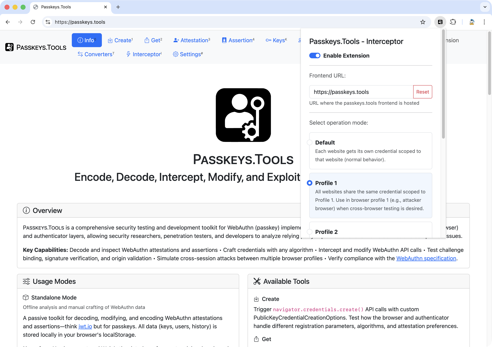

# 🔐 Passkeys.Tools

A comprehensive security testing and development toolkit for WebAuthn (passkey) implementations. Passkeys.Tools provides full emulation of both the client (browser) and authenticator layers, allowing security researchers, penetration testers, and developers to analyze relying party implementations for vulnerabilities and compliance issues.

**Key Capabilities:** Decode and modify WebAuthn attestations and assertions, craft credentials with any algorithm, intercept and modify WebAuthn API calls, test challenge binding, signature verification, and origin validation, simulate cross-session attacks between multiple browser profiles, and verify compliance with the [WebAuthn specification](https://www.w3.org/TR/webauthn-3/).



## 🛠️ Development Setup

Run the frontend and backend separately:

```bash
# Terminal 1: Start the frontend
cd frontend
npm install
npm run dev

# Terminal 2: Start the backend
cd backend
npm install
npm run dev
```

The frontend will be available at `http://localhost:5173` and the backend at `http://localhost:3000`.

## 🐳 Production Setup with Docker

Deploy the full stack using Docker Compose:

```bash
docker compose up -d
```

### Environment Variables

Configure the deployment by setting these environment variables (or create a `.env` file):

| Variable | Default | Description |
|----------|---------|-------------|
| `LOG_LEVEL` | `INFO` | Log level (`ERROR`, `WARN`, `INFO`, `DEBUG`) |
| `NODE_ENV` | `production` | Environment mode (`production`, `development`) |
| `DATA` | `/tmp/pkvolume` | Path for persistent data storage |
| `ADMIN_USER` | `admin` | MongoDB admin username |
| `ADMIN_PASS` | `changeme` | MongoDB admin password |
| `ADMIN_HASH` | `admin:$2y$...` | Bcrypt hash for Traefik basic auth (format: `user:hash`) |
| `FRONTEND_EXTERNAL_DOMAIN` | `frontend.docker.localhost` | Domain for the frontend |
| `BACKEND_EXTERNAL_DOMAIN` | `backend.docker.localhost` | Domain for the backend API |
| `MONGOEXPRESS_EXTERNAL_DOMAIN` | `mongoexpress.docker.localhost` | Domain for Mongo Express admin UI |
| `TRAEFIK_EXTERNAL_DOMAIN` | `traefik.docker.localhost` | Domain for Traefik dashboard |

The stack includes:
- 🌐 **Frontend** - Vite-based web application (port 4173)
- ⚙️ **Backend** - Express.js API server (port 3000)
- 🗄️ **MongoDB** - Database for remote storage mode (port 27017)
- 🔀 **Traefik** - Reverse proxy with automatic HTTPS (ports 80, 443)

## 📖 Usage Modes

### 📦 Standalone Mode

No setup required. Open [Passkeys.Tools](https://passkeys.tools) in your browser and start using the Attestation, Assertion, Keys, and Converters tabs. All data is stored locally in your browser's localStorage.

**Use when:** You have captured WebAuthn data (e.g., from network logs) and need to analyze or modify it offline.

### ⚡ Interceptor Mode

Intercept and modify live WebAuthn API calls using the browser extension:

1. **Download the extension:** Click "Extension" in the navbar to download the extension package.

2. **Install the extension:** Extract the archive. In Chrome, go to `chrome://extensions`, enable "Developer mode", click "Load unpacked", and select the extracted folder.

3. **Configure the extension:** Click the extension icon and configure:
   - **Frontend URL:** URL of your Passkeys.Tools instance (default: `https://passkeys.tools`)
   - **Operation Mode:** Select "Default" for normal per-site credential scoping
   - **Popup Display Mode:** Choose "Detached Window" or "Inline Popup"

4. **Start intercepting:** Visit any website using WebAuthn. When a registration or authentication triggers, Passkeys.Tools opens automatically for inspection and modification.

**Use when:** You need to test a relying party's server-side validation by modifying live WebAuthn responses.

### 🌐 Cross-Browser Mode

Share data between multiple browser profiles for cross-session attack testing:

1. **Install the extension** in all Chrome profiles you want to use.

2. **Configure Operation Mode:** Select "Profile 1" in one browser (e.g., attacker) and "Profile 2" in another (e.g., victim).

3. **Enable Remote Storage:** Go to the Settings tab and select "Remote Storage" mode.

4. **Set the Server URL:** Enter the backend URL:
   - Hosted: `https://db.passkeys.tools`
   - Self-hosted: Your backend server URL

5. **Configure a Secret:** Enter a unique secret string. This acts as your account identifier—all browsers using the same secret share the same data.

6. **Enable End-to-End Encryption (recommended):** All data is encrypted in your browser before being sent to the server.

7. **Apply identical settings** (Server URL, Secret, E2E Encryption) in every browser profile that should share data.

**Use when:** You need to simulate attacks involving multiple parties, such as session binding or credential reuse across different sessions.

## 🧰 Available Tools

| Tool | Description |
|------|-------------|
| 📥 **Create** | Trigger `navigator.credentials.create()` API calls with custom PublicKeyCredentialCreationOptions |
| 📤 **Get** | Trigger `navigator.credentials.get()` API calls with custom PublicKeyCredentialRequestOptions |
| 📝 **Attestation** | Decode, inspect, modify, and re-encode attestation objects and clientDataJSON |
| ✍️ **Assertion** | Decode, modify, and encode assertion authenticatorData, clientDataJSON, and signatures |
| 🔑 **Keys** | Manage cryptographic keys with full import/export support for all WebAuthn algorithms |
| 👥 **Users** | Store and manage user account data including RP IDs, usernames, and user handles |
| 📜 **History** | Complete audit log of all intercepted operations with search and export |
| 🔄 **Converters** | Encoding utilities for Base64, Base64URL, Hex, and key format conversions |
| ⚡ **Interceptor** | Central hub for live WebAuthn interception with one-click security tests |
